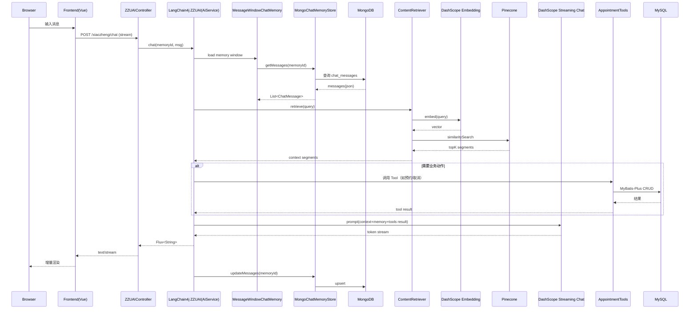
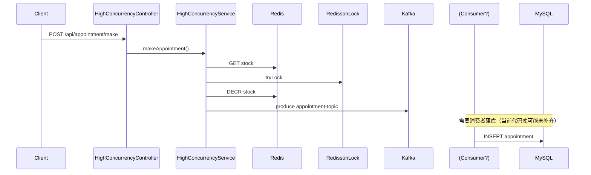

# 核心架构（ZZU-hospital-assist）

> 本文面向“读代码/部署/排障”，按真实调用链抽取组件与数据流。

## 1. 技术栈与边界

- 后端：Spring Boot 3.2.x（Web + WebFlux）
- AI：LangChain4j 1.0.0-beta3（AiService + Tools + RAG）
- LLM/Embedding：DashScope（Qwen streaming chat + text-embedding-v3）
- 向量库：Pinecone（index: `zzuhos-index`，namespace: `zzuhos-namespace`）
- 记忆：MongoDB（`MongoChatMemoryStore` 持久化聊天消息）
- 业务数据：MySQL + MyBatis-Plus（预约记录等）
- 缓存/会话：Redis + Spring Session Redis
- 高并发演示：Redisson 分布式锁 + Kafka 异步消息

## 2. 核心调用链（聊天 / RAG / Tools）

**入口**：`POST /xiaozheng/chat`（`text/stream;charset=utf-8`）

- Controller：`ZZUAIController.chat(ChatForm)` → `ZZUAI.chat(memoryId, message)`
- AiService：`assistant/ZZUAI.java`
  - `streamingChatModel = qwenStreamingChatModel`
  - `chatMemoryProvider = chatMemoryProviderZZU`
  - `tools = appointmentTools`
  - `contentRetriever = contentRetrieverZZUPinecone`
- 记忆：`chatMemoryProviderZZU` → `MessageWindowChatMemory(max=30)` → `MongoChatMemoryStore`
- RAG：`EmbeddingStoreContentRetriever(embeddingModel + pineconeStore)`（`maxResults=1`，`minScore=0.8`）
- Tools：`AppointmentTools`（查询号源、预约挂号、取消预约…）

## 3. 组件图（运行时）

```mermaid
flowchart LR
  U[用户浏览器] -->|HTTP(s)\n/ api proxy 可选| FE[前端 Vue(Vite) 或 Nginx 静态站点]
  FE -->|POST /xiaozheng/chat\ntext/stream| BE[Spring Boot App :8080]

  subgraph BE[Spring Boot App]
    C1[ZZUAIController\n/xiaozheng/chat]
    A1[LangChain4j AiService\nZZUAI]
    M1[ChatMemoryProvider\nchatMemoryProviderZZU]
    MS[MongoChatMemoryStore\nChatMemoryStore]
    R1[ContentRetriever\nEmbeddingStoreContentRetriever]
    T1[Tools\nAppointmentTools]
    S1[AppointmentService\nMyBatis-Plus]
    HC[HighConcurrency*\nRedis+Lock+Kafka]
  end

  C1 --> A1
  A1 --> M1 --> MS --> MDB[(MongoDB\nlangchain4j_chat_memory)]

  A1 --> R1 --> EM[DashScope Embedding\ntext-embedding-v3]
  R1 --> PC[(Pinecone\nzzuhos-index/zzuhos-namespace)]

  A1 --> LLM[DashScope Streaming Chat\nqwen-plus]
  A1 --> T1 --> S1 --> MYSQL[(MySQL\nzzuass)]

  BE -->|Session| REDIS[(Redis\nSpring Session)]
  HC --> REDIS
  HC --> KAFKA[(Kafka\nappointment-topic)]

  style HC stroke-dasharray: 5 5
```

> 说明：`HighConcurrency*` 为高并发预约演示链路；实际预约 Tools 当前是直接 `AppointmentService.save()` 落库。

## 4. 聊天链路时序图（Streaming + Memory + RAG + Tools）



## 5. 高并发预约演示链路（Redis + Lock + Kafka）



## 6. 关键配置入口（追溯点）

- `src/main/resources/application.yml`
  - `langchain4j.community.dashscope.*`
  - `spring.data.mongodb.uri`
  - `spring.data.redis.*` + `spring.session.*`
  - `spring.kafka.*`
  - `spring.datasource.*`
- `config/ZZUAIConfig.java`：`chatMemoryProviderZZU`、`contentRetrieverZZUPinecone`
- `config/EmbeddingStoreConfig.java`：Pinecone index/namespace + dimension
- `store/MongoChatMemoryStore.java`：聊天记忆读写（支持 SHORT/LONG 记忆类型）

